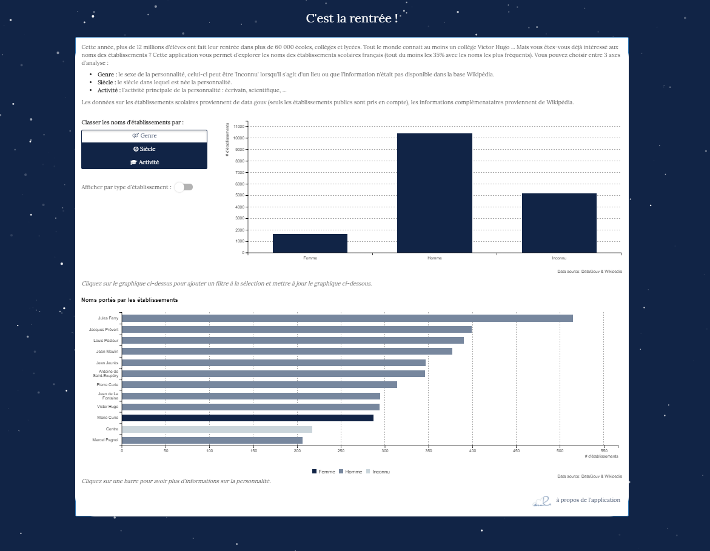
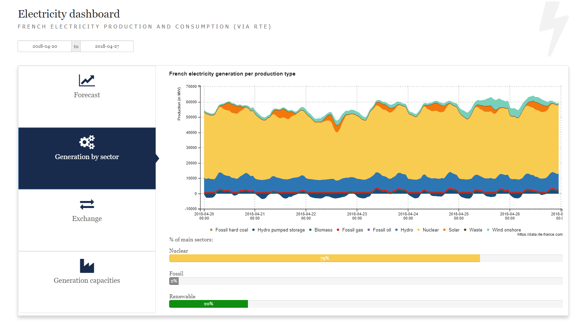

# shinyapps

> Some Shiny applications


## C'est la rentrée !

An application to explore the name of public schools in France. The names are represented by the gender, activity, and century of the personality by which establishments were named. More frequent names can be visualized, and you can access to the biography of a personality. All application is in French.

**Packages** : The application use the following packages : [`shiny`](https://shiny.rstudio.com/), [`shinyWidgets`](https://github.com/dreamRs/shinyWidgets), [`billboarder`](https://github.com/dreamRs/billboarder). To see which versions of these packages are used (and dependancies), look at the file `session_info.txt` in app directory. If packages are not installed, they will be on application launch.

**Data sources** : Names of shcools are from [data.gouv](https://www.data.gouv.fr/fr/datasets/etablissements-scolaires/), data about personality are from Wikipedia and DBpedia.

Launch application : 

```r
shiny::runGitHub(repo = "dreamRs/shinyapps", subdir = "rentree_scolaire")
```




## Electricity dashboard


Explore power consumption, production and exchanges in France via RTE's API.

**Packages** : The application use the following packages : [`shiny`](https://shiny.rstudio.com/), [`shinyWidgets`](https://github.com/dreamRs/shinyWidgets), [`billboarder`](https://github.com/dreamRs/billboarder), [`leaflet`](https://rstudio.github.io/leaflet/), [`rte.data`](https://github.com/dreamRs/rte.data). To see which versions of these packages are used (and dependancies), look at the file `session_info.txt` in app directory. 

**Data sources** : The data is recovered via the RTE API, a key is required to recover the data but backup data is included in the application to be able to launch it without having access to the API.

Launch application : 

```r
shiny::runGitHub(repo = "dreamRs/shinyapps", subdir = "dashboard_elec")
```


## RATP Traffic


Explore Paris metro traffic ; how it can vary according to the type of day or according to the line or the station.
Also, discover the different characteristics of each line.

**Packages** : The application use the following packages : 
[`shiny`](https://shiny.rstudio.com/), [`shinyWidgets`](https://github.com/dreamRs/shinyWidgets), 
[`shinythemes`]("https://rstudio.github.io/shinythemes/"), [`shinydashboard`]("https://rstudio.github.io/shinydashboard/"),
[`dplyr`]("https://github.com/tidyverse/dplyr"),
[`leaflet`](https://rstudio.github.io/leaflet/), [`leaflet.extras`]("https://github.com/bhaskarvk/leaflet.extras"),
[`scales`]("https://github.com/r-lib/scales"),
[`billboarder`](https://github.com/dreamRs/billboarder), 
[`stringr`]("https://github.com/tidyverse/stringr")


**Data sources** : The data is recovered via the STIF Open data website : ("https://opendata.stif.info/")


Launch application : 

```r
shiny::runGitHub(repo = "dreamRs/shinyapps", subdir = "ratp_traffic")
```


## GitHub dashboard

Quick dashboard of a GitHub user/organization.

:warning: It is recommended to have a registered GitHub token / PAT (see `?gh::gh_whoami`)

**Packages** : The application use the following packages : 
[`shiny`](https://shiny.rstudio.com/), [`shinyWidgets`](https://github.com/dreamRs/shinyWidgets), [`ggplot2`](https://github.com/tidyverse/ggplot2),
[`gh`](https://github.com/r-lib/gh).


Launch application : 

```r
shiny::runGitHub(repo = "dreamRs/shinyapps", subdir = "gh-dashboard")
```


